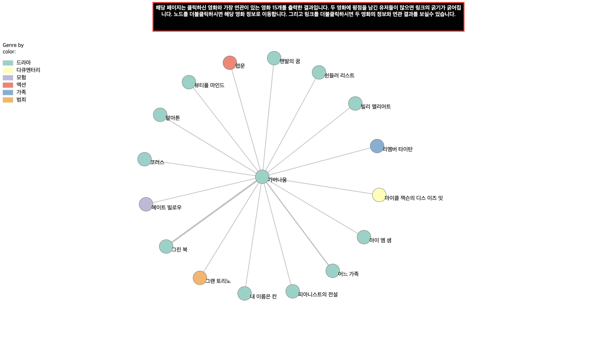

# Sparta_Web_Project

## 네이버 영화에 평점을 남긴 유저들을 비교하여 영화들의 상관관계를 보여주는 사이트입니다.
- 그 당시 네이버 영화 순위 300위까지의 영화들의 정보와 별점을 남긴 유저들을 크롤링하여 Mongo DB에 저장하였고,
  두 영화의 상관관계를 비교분석하여 Json파일로 만들었고, 그 상관관계를 보여주기 위해서 Flask를 이용하여 서버를 만들었고, D3 라이브러리로 그래프를 표현하였습니다.
 
- 구조
  - controller - 비즈니스 로직을 처리하는 뷰 함수가 구현된 컨트롤러 모듈이 있는 패키지
    - homepage.py = 홈 화면을 보여주는 모듈
    - compare_graph.py = 상관관계를 보여주는 모듈
    - naver_movie_info.py = 영화정보를 보여주는 모듈
    - two_movie_infos.py = 두 영화정보들을 보여주는 모듈
  - model - MongoDB를 연결하고 처리하는 함수
    - get_movie_info = 영화정보를 전달하는 모듈
    - get_movie_lists = 영화 300개의 리스트들을 전달하는 모듈
    - get_movies_score = 영화의 상관관계를 전달하는 모듈
  - resource - 로그 파일들의 리소스 파일이 있는 파일
  - static - CSS 및 자바스크립트 파일이 있는 폴더
  - templates - HTML 파일이 있는 폴더
- 첫 페이지
  - routes = '/'

- 클릭한 영화들의 상관관계를 보여주는 페이지
  - routes = '/compare_graph'

- 비교 상세 페이지
  - routes = '/infos'

- 영화 상세 페이지
  - routes = '/info'

